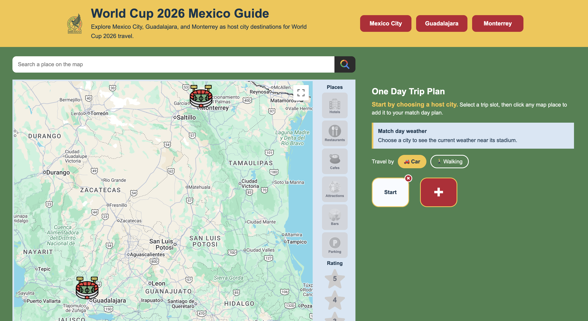
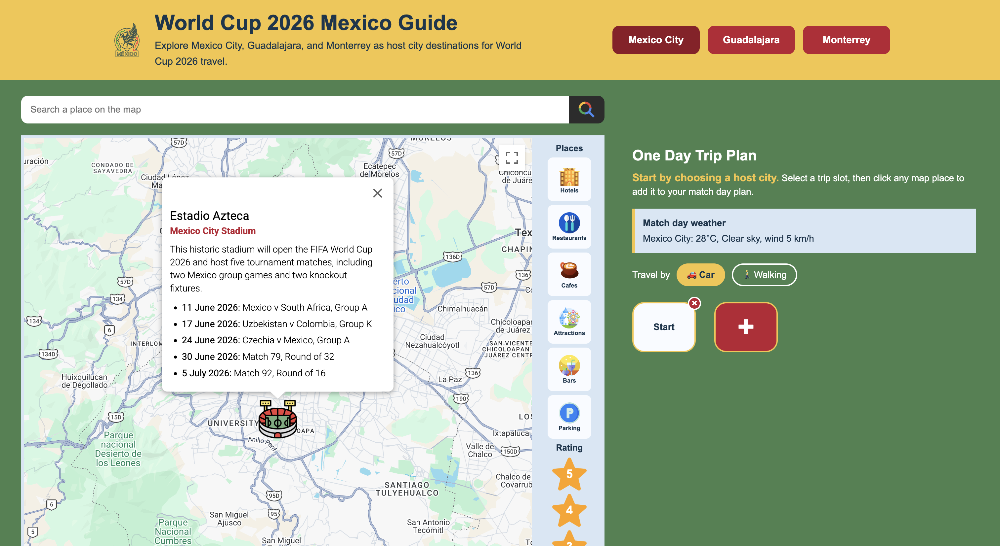
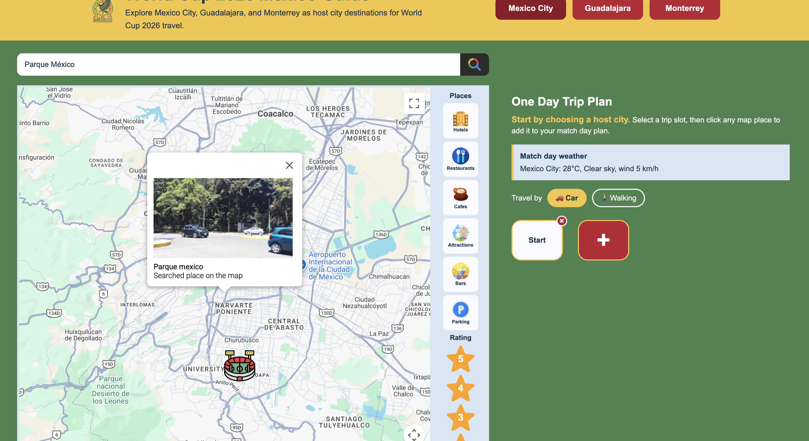
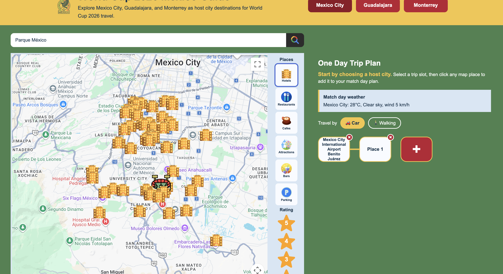
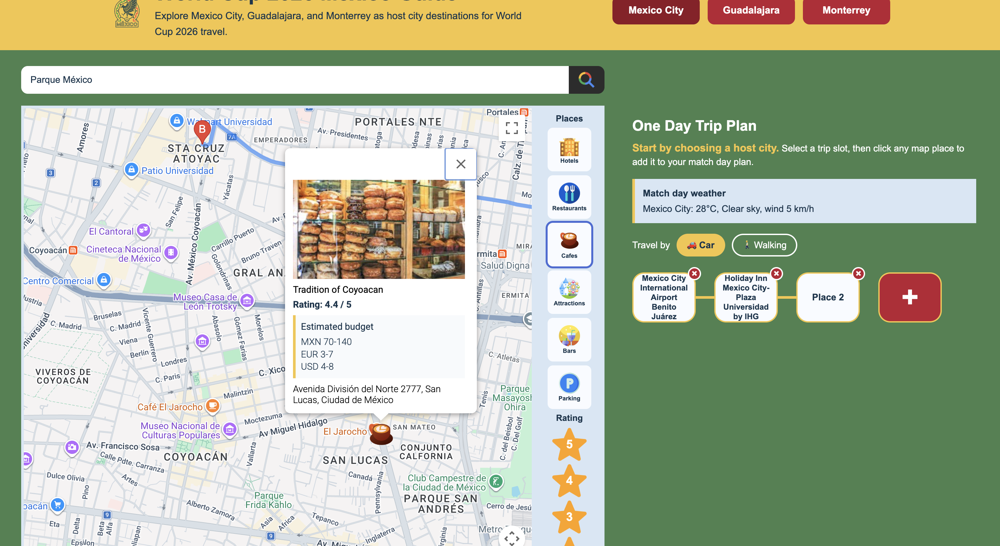
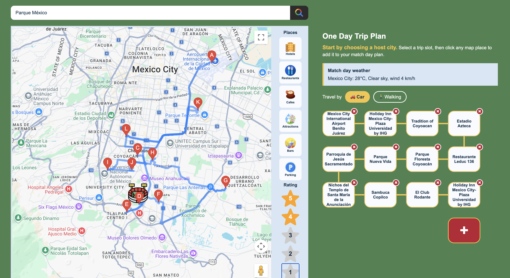

# 🌍 World Cup 2026 Mexico Guide

An interactive travel guide web app built for tourists visiting Mexico during the **FIFA World Cup 2026**. The app helps
users explore Mexico City, Guadalajara, and Monterrey — the three Mexican host cities — with an interactive Google Map,
one-day trip planning, live weather, currency conversion, and more.

---

## Screenshots

<details>
<summary>Overview — all three host cities</summary>


</details>

<details>
<summary>Stadium info — match schedule popup</summary>


</details>

<details>
<summary>Place search with photo</summary>


</details>

<details>
<summary>Hotels filter — custom markers across the city</summary>


</details>

<details>
<summary>Restaurant popup — photo, rating, budget in MXN / EUR / USD</summary>


</details>

<details>
<summary>Full route — 10 stops planned and drawn on the map</summary>


</details>

---

## Features

### 🗺️ Interactive Google Map

- Displays all three Mexican World Cup host stadiums as custom markers
- Click any stadium to focus the map on that city
- Click anywhere on the map to add a location to your trip plan
- Custom PNG markers for every category of place

### 📍 Nearby Places (Google Places API)

Filter and explore places around each stadium:

- Hotels
- Restaurants
- Cafes
- Attractions
- Bars
- Parking

### ⭐ Rating Filter

Filter nearby places by star rating (1–5) with toggle buttons.

### 🗓️ One-Day Trip Planner

- Build a custom route with up to 16 stops
- Add places by clicking on the map or any marker
- Delete any stop, including the Start point
- Choose travel mode: **🚗 Car** or **🚶 Walking**
- Live route drawn on the map via Google Directions API

### 🌤️ Live Weather

Real-time weather at the selected stadium — temperature, conditions, and wind speed — powered by
the [Open-Meteo API](https://open-meteo.com/).

### 💱 Currency Conversion

Estimated budgets for hotels, restaurants, cafes, and bars shown in **MXN**, **EUR**, and **USD** with live exchange
rates from the [Frankfurter API](https://frankfurter.dev/).

### 🔍 Place Search

Search for any place within the selected city or across all three host cities.

### 📱 Fully Responsive

- **Mobile phones** (< 600px): hamburger menu, stacked layout, no horizontal scrolling
- **Tablets** (600–768px): adapted two-column layout
- **Desktop** (> 768px): full horizontal navigation with side panels

### ⬇️ Progressive Web App (PWA)

Installable on desktop, phone, or tablet directly from the browser. Static assets are cached via a service worker for
offline use.

---

## Tech Stack

| Layer      | Technology                                                    |
|------------|---------------------------------------------------------------|
| Language   | Vanilla JavaScript (ES Modules)                               |
| Markup     | HTML5                                                         |
| Styling    | CSS3 — no frameworks                                          |
| Map        | Google Maps JavaScript API                                    |
| Places     | Google Places API (Nearby Search, Text Search, Place Details) |
| Directions | Google Directions API                                         |
| Weather    | [Open-Meteo API](https://open-meteo.com/)                     |
| Currency   | [Frankfurter API](https://frankfurter.dev/)                   |
| Data       | Local JSON file                                               |
| Offline    | Web App Manifest + Service Worker                             |

**No frameworks. No third-party UI libraries. No build step.** Pure HTML, CSS, and JavaScript.

---

## Project Structure

```
Google-Map-Website/
├── index.html              # Main HTML page
├── index.js                # App entry point — wires all modules together
├── manifest.json           # PWA manifest
├── sw.js                   # Service worker (cache-first offline strategy)
├── icon.svg                # App logo
├── css/
│   └── style.css           # All styles — responsive breakpoints, layout, components
├── js/
│   ├── data/
│   │   ├── locations.json  # Stadium data (city, coordinates, info content)
│   │   └── locations.js    # JSON loader
│   ├── map/
│   │   └── MapManager.js   # Map, markers, directions, search, info windows
│   ├── planner/
│   │   └── DayPlanner.js   # Trip planner UI and route logic
│   └── services/
│       ├── WeatherService.js   # Open-Meteo API integration
│       └── CurrencyService.js  # Frankfurter API + rate caching
└── images/
    ├── icons/              # PWA icons (192×192, 512×512)
    └── markers/            # Custom map marker PNGs per category
```

---

## Running Locally

No build step required. Just serve the folder from any static web server.

**1. Set up your API key:**

```bash
cp config.example.js config.js
# Open config.js and paste your Google Maps API key
```

**2. Start a local server:**

VS Code Live Server — right-click `index.html` → **Open with Live Server**

Or with Node.js:

```bash
npx serve .
```

> `config.js` is listed in `.gitignore` and is never committed to git. Only `config.example.js` is tracked.

---

## Architecture

### ES Modules — no globals

Every piece of logic lives in its own class. `index.js` imports and wires them together. No global variables, no inline
scripts beyond bootstrapping.

### MapManager

Handles all map concerns: rendering stadium and category markers, deduplicating paginated Google Places results across
multiple API pages, building info window content with photos and budgets, and calculating directions with a configurable
travel mode (driving or walking).

### DayPlanner

Manages the trip builder UI independently from the map. Communicates with `MapManager` through a single `onRouteChanged`
callback — the two modules never reference each other directly.

### Services

`WeatherService` and `CurrencyService` are thin wrappers around external REST APIs. `CurrencyService` caches exchange
rates after the first fetch so every subsequent info window popup reuses the same response without extra network calls.

### PWA / Service Worker

Cache-first strategy: all static assets are pre-cached on install. Google Maps API requests bypass the cache and always
go to the network so map data stays fresh.

---

## APIs

| API                        | Purpose                              | Key Required   |
|----------------------------|--------------------------------------|----------------|
| Google Maps JavaScript API | Map rendering, markers, info windows | ✅              |
| Google Places API          | Nearby search, place details, photos | ✅ (same key)   |
| Google Directions API      | Route + travel time calculation      | ✅ (same key)   |
| Open-Meteo                 | Live weather at stadium locations    | ❌ Free, no key |
| Frankfurter                | MXN → EUR / USD live exchange rates  | ❌ Free, no key |
